<h1 align="center">Computer Vision And NLP Course</h1>

  
   
  <h3>
    <a href="https://github.com/Darker2003/computervision.git">Read on Github</a>
  </h3>
  

    Join/follow me on <a href="#" target="_blank">Discord</a> | <a href="#" target="_blank">𝕏 (Twitter)</a> | <a href="#" target="_blank">Telegram</a> |  <a href="#" target="_blank">Facebook</a>
  

    

    Thanks to Mentors <a href="#" target="_blank">Mr. Dong</a> | <a href="#" target="_blank">Mr. Tan</a> 
  

---

## About this course?

This course teaches about Deep Learning, Computer Vision and Natural Language Processing.

### Course syllabus:
    Topic 1: Introduce DL and CV 
- [Day 1: Introduction to Deep Learning and Neural Networks](https://github.com/Darker2003/computervision/tree/main/day01) 

    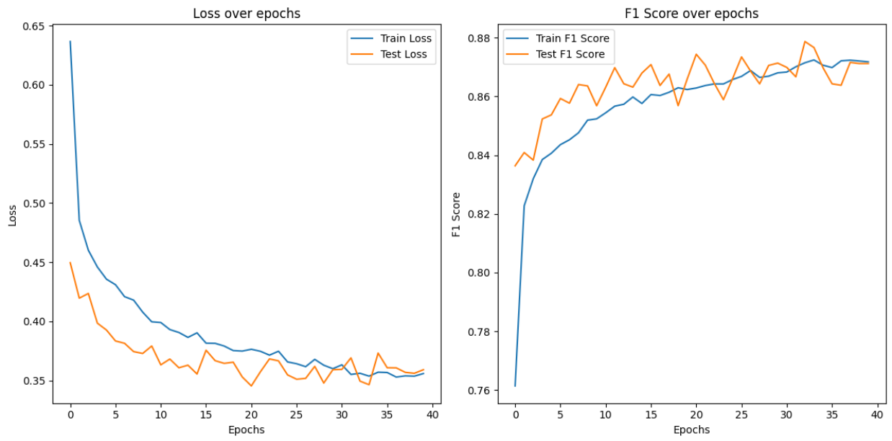
    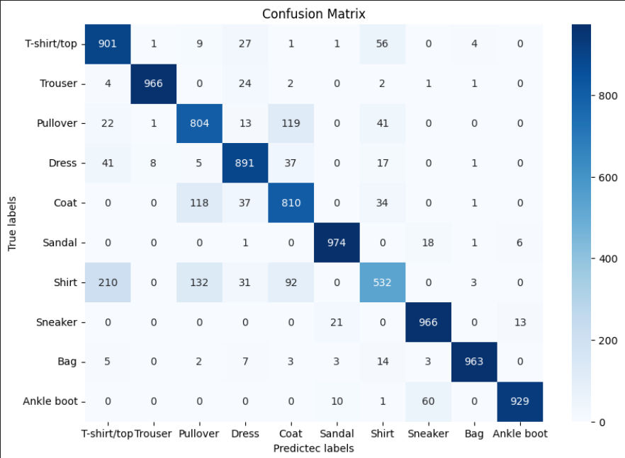
    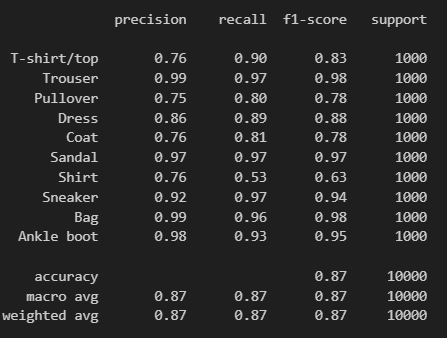

- [Day 2: Introduction to Convolutional Neural Networks ( CNNs )](https://github.com/Darker2003/computervision/tree/main/day02)

    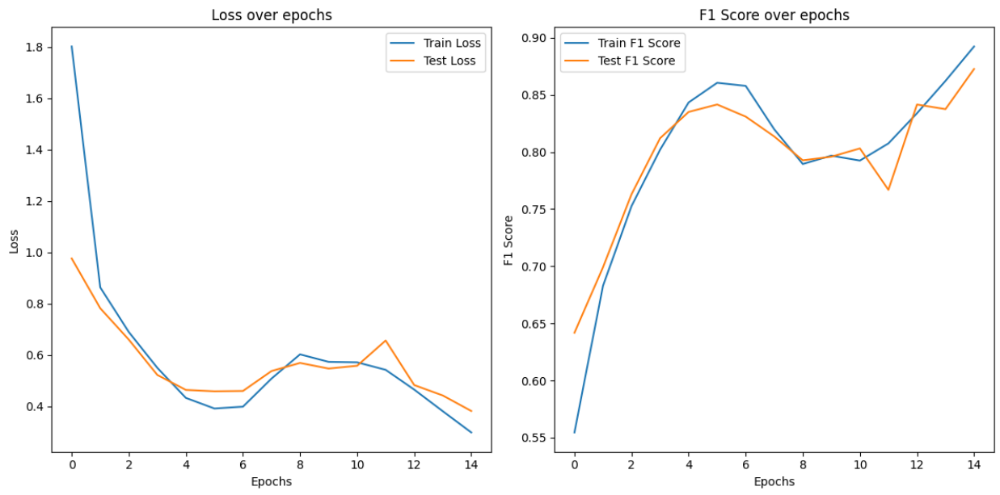
    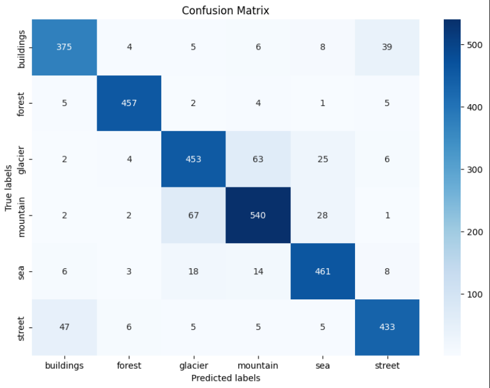
    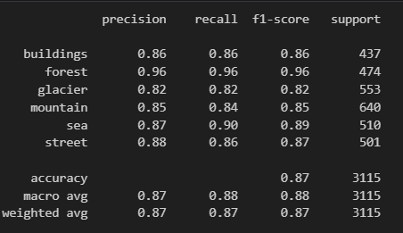

    Topic 2: Object Classification
- [Day 3:  Images Classification with CNNs](https://github.com/Darker2003/computervision/tree/main/day03)

    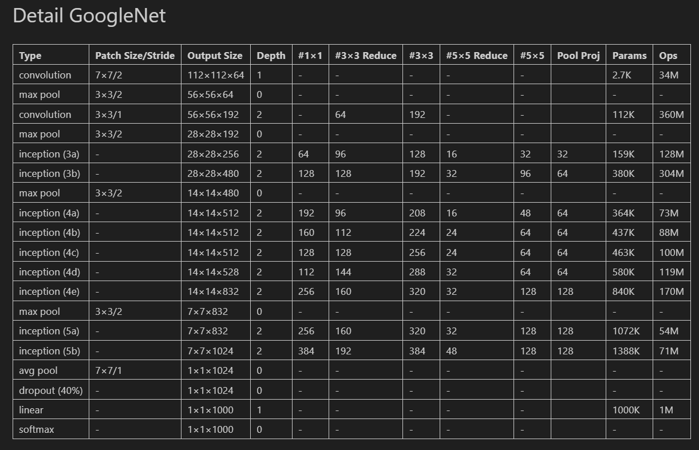
    <h5>Model API</h5>
    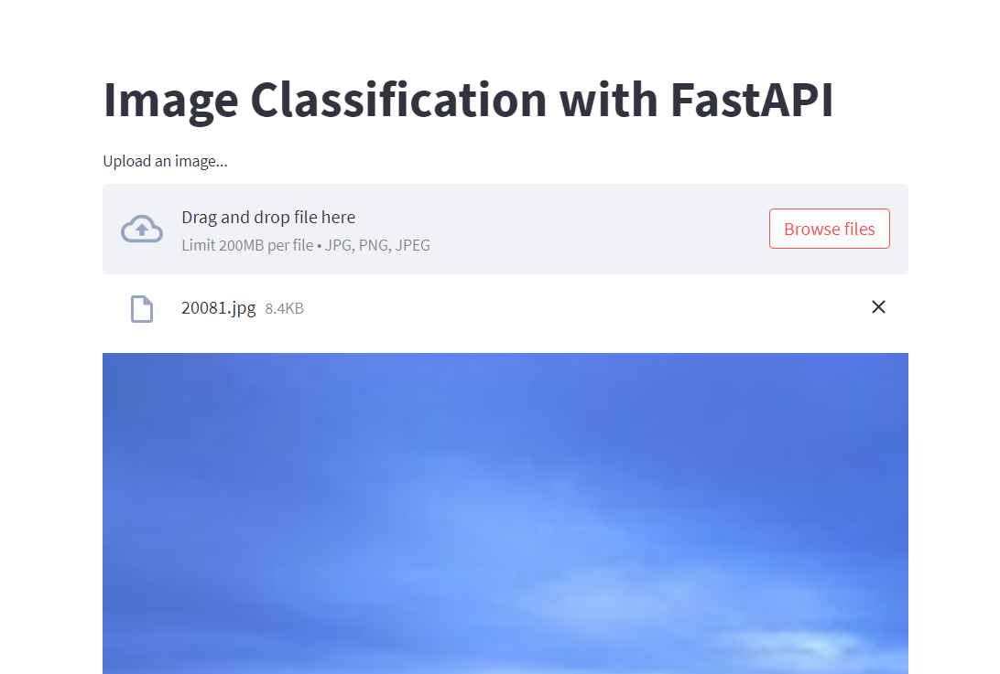
    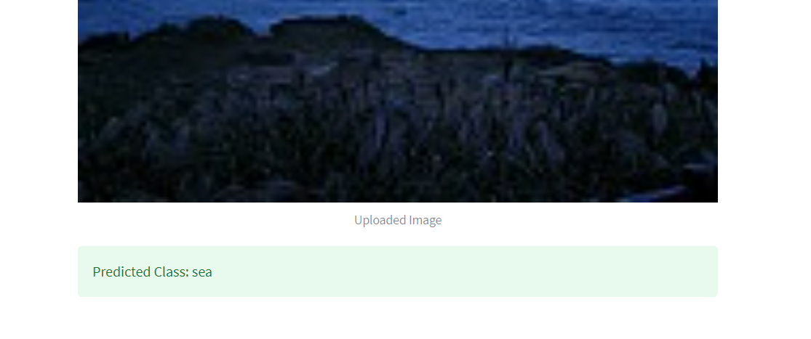

- [Day 4: Transfer Learning and Fine-Tuning](https://github.com/Darker2003/computervision/tree/main/day04)

    <h5>Transfer Learning</h5>
    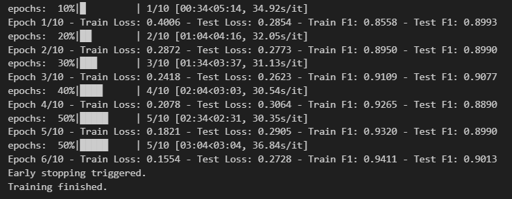
    <h5>Optuna</h5>
    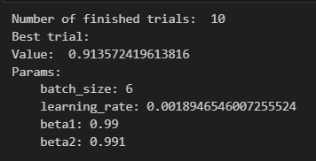
    <h5>Mlflow</h5>
    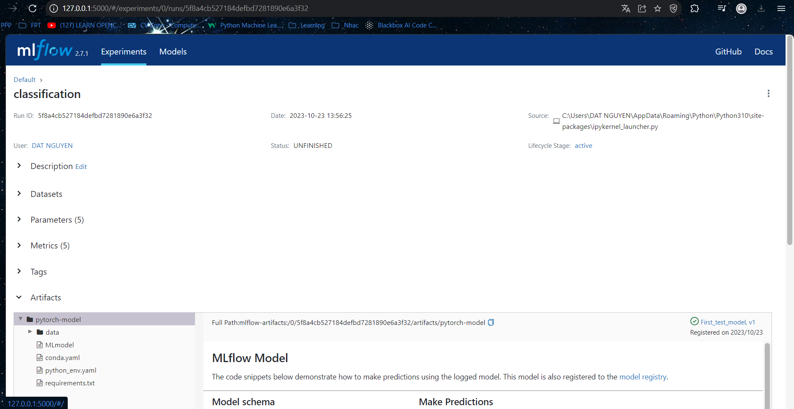

- [Day 5: Handling Imbalanced Datasets](https://github.com/Darker2003/computervision/tree/main/day05)
- [Day 6: Sharing about Advance Techniques for Object Classification](https://github.com/Darker2003/computervision/tree/main/day06)

    <h5>VGG19 Onnx 16bit</h5>
    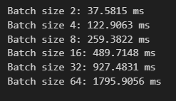
    <h5>VGG19 Onnx 32bit</h5>
    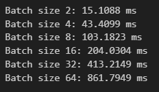
    <h5>ResNet18</h5>
    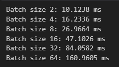

- [Day 7: Optimize model using ONNX and TensorRT](https://github.com/Darker2003/computervision/tree/main/day07)

    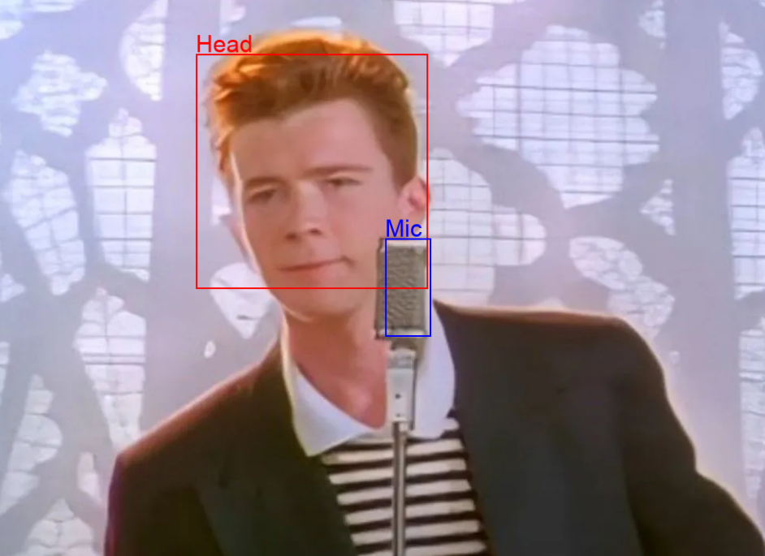
    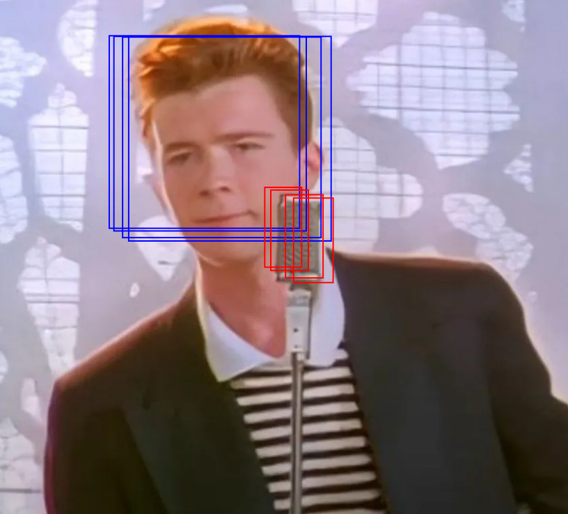

    Topic 3: Object Detection
- [Day 8: Introduction to Object Detection](#)
- [Day 9: Single-stage Object Detection: YOLO](#)
- [Day 10: Two-stage Object Detection: Faster R-CNN](#)
- [Day 10 (Optional):  SOTA for Object Detection Problem](#)

    Topic 4: Image Segmentation
- [Day 11: Introduce to Image Segmentation](#)
- [Day 12: CNN for Segmentation](#)
- [Day 13: Advance Segmentation Techniques](#)
- [Day 14: Evaluation and Metrics for Segmentation](#)

    Topic 5: Multi-modal Transformers
- [Day 15: State-of-the-art in NLP](#)
- [Day 16:State-of-the-art in CV](#)
- [Day 17: Image2Text](#)
- [Day 18: Text2Image](#)
- [Day 19: Multi-modal model](#)
- [Day 20: Advanced techniques to speed up training](#)

Help from you in contributing content would be very much appreciated!

## Why did I learn this course?

This course has **practical** content that covers basic to advanced, from practising myself to applying for a job. 

---

  <h3>💡 Stop grinding mindlessly! Study coding and learning parallelly 💡
  </h3>

---